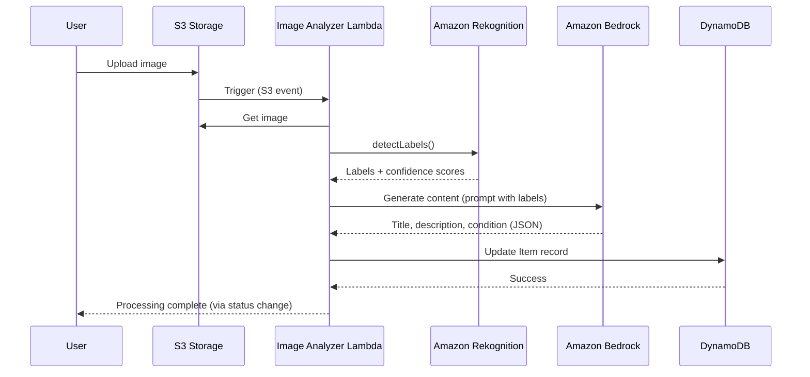

# Design Document: AI Image Analysis

## Overview

The AI Image Analysis feature implements the "Snap & Sell" capability for EcoBid using a serverless, event-driven architecture. The system leverages AWS Amplify Gen 2 to define an AWS Lambda function that orchestrates Amazon Rekognition for computer vision and Amazon Bedrock (Claude 3 Haiku) for natural language generation. When a user uploads an image to S3, the function automatically generates item metadata (tags, title, description, condition assessment) and updates the DynamoDB record.

This design prioritizes AWS Free Tier compliance, fast processing times (<5 seconds), and graceful error handling to ensure a reliable user experience.

## Architecture

### High-Level Flow



### Deployment Architecture

The function is defined using Amplify Gen 2's `defineFunction` in `amplify/backend.ts`:

```typescript
// amplify/backend.ts
import { defineBackend } from '@aws-amplify/backend';
import { analyzeImage } from './functions/analyze-image/resource';
import { data } from './data/resource';
import { storage } from './storage/resource';

const backend = defineBackend({
  analyzeImage,
  data,
  storage
});

// Grant permissions
backend.analyzeImage.resources.lambda.addToRolePolicy(
  new PolicyStatement({
    actions: ['rekognition:DetectLabels'],
    resources: ['*']
  })
);

backend.analyzeImage.resources.lambda.addToRolePolicy(
  new PolicyStatement({
    actions: ['bedrock:InvokeModel'],
    resources: ['arn:aws:bedrock:*::foundation-model/anthropic.claude-3-haiku-*']
  })
);

// S3 trigger configuration
backend.storage.resources.bucket.addEventNotification(
  s3.EventType.OBJECT_CREATED,
  new s3n.LambdaDestination(backend.analyzeImage.resources.lambda),
  { prefix: 'uploads/', suffix: '.jpg' }
);
```

### Technology Stack

- **Runtime**: Node.js 20.x (TypeScript)
- **Vision AI**: Amazon Rekognition (detectLabels API)
- **Language AI**: Amazon Bedrock (Claude 3 Haiku model: `anthropic.claude-3-haiku-20240307-v1:0`)
- **Database**: DynamoDB (via Amplify Data)
- **Storage**: S3 (via Amplify Storage)
- **Infrastructure**: AWS Amplify Gen 2 (CDK-based)

## Components and Interfaces

### 1. Lambda Function Handler

**File**: `amplify/functions/analyze-image/handler.ts`

**Responsibilities**:
- Parse S3 event to extract bucket and key
- Orchestrate AI service calls
- Handle errors and retries
- Update DynamoDB records

**Interface**:

```typescript
export const handler = async (event: S3Event): Promise<void> => {
  // Main entry point triggered by S3 upload
}
```

### 2. Image Retrieval Module

**Responsibilities**:
- Fetch image from S3
- Validate image format
- Handle S3 access errors

**Interface**:

```typescript
async function getImageFromS3(bucket: string, key: string): Promise<Buffer> {
  // Returns image buffer for processing
}
```

### 3. Rekognition Service Module

**Responsibilities**:
- Call Amazon Rekognition detectLabels API
- Filter labels by confidence threshold (70%)
- Extract top 10 labels
- Handle service errors

**Interface**:

```typescript
interface RekognitionLabel {
  name: string;
  confidence: number;
}

async function detectLabels(imageBuffer: Buffer): Promise<RekognitionLabel[]> {
  // Returns array of detected labels with confidence scores
}
```

**API Call**:

```typescript
const rekognition = new RekognitionClient({ region: process.env.AWS_REGION });
const command = new DetectLabelsCommand({
  Image: { Bytes: imageBuffer },
  MinConfidence: 70,
  MaxLabels: 10
});
const response = await rekognition.send(command);
```

### 4. Bedrock Service Module

**Responsibilities**:
- Construct prompt with detected labels
- Call Amazon Bedrock with Claude 3 Haiku
- Parse JSON response
- Handle malformed responses and retries

**Interface**:

```typescript
interface GeneratedContent {
  title: string;
  description: string;
  condition: string;
}

async function generateContent(labels: RekognitionLabel[]): Promise<GeneratedContent> {
  // Returns AI-generated item metadata
}
```

**Prompt Template**:

```typescript
const prompt = `You are an expert at creating appealing marketplace listings. Based on the following objects detected in an image, generate a listing.

Detected objects: ${labels.map(l => l.name).join(', ')}

Generate a JSON response with:
1. "title": A concise, appealing title (max 60 characters)
2. "description": A detailed, honest description (2-3 sentences)
3. "condition": Assessment of condition ("Excellent", "Good", "Fair", or "Poor")

Example output:
{
  "title": "Vintage Wooden Chair - Classic Design",
  "description": "Beautiful wooden chair with classic design. Shows minor wear consistent with age but structurally sound. Perfect for a reading nook or dining room.",
  "condition": "Good"
}

Respond ONLY with valid JSON:`;
```

**API Call**:

```typescript
const bedrock = new BedrockRuntimeClient({ region: process.env.AWS_REGION });
const command = new InvokeModelCommand({
  modelId: 'anthropic.claude-3-haiku-20240307-v1:0',
  contentType: 'application/json',
  accept: 'application/json',
  body: JSON.stringify({
    anthropic_version: 'bedrock-2023-05-31',
    max_tokens: 500,
    messages: [{
      role: 'user',
      content: prompt
    }]
  })
});
```

### 5. DynamoDB Update Module

**Responsibilities**:
- Update Item record with AI-generated metadata
- Change status from DRAFT to REVIEW
- Implement retry logic with exponential backoff
- Handle update failures

**Interface**:

```typescript
interface ItemUpdate {
  itemId: string;
  aiTags: string[];
  aiDescription: string;
  aiConditionAssessment: string;
}

async function updateItemRecord(update: ItemUpdate): Promise<void> {
  // Updates DynamoDB record with retry logic
}
```

**Update Operation**:

```typescript
const dynamodb = new DynamoDBClient({ region: process.env.AWS_REGION });
const command = new UpdateItemCommand({
  TableName: process.env.ITEM_TABLE_NAME,
  Key: { id: { S: itemId } },
  UpdateExpression: 'SET aiTags = :tags, aiDescription = :desc, aiConditionAssessment = :cond, #status = :status',
  ExpressionAttributeNames: { '#status': 'status' },
  ExpressionAttributeValues: {
    ':tags': { L: aiTags.map(tag => ({ S: tag })) },
    ':desc': { S: aiDescription },
    ':cond': { S: aiConditionAssessment },
    ':status': { S: 'REVIEW' }
  }
});
```

### 6. Error Handler Module

**Responsibilities**:
- Centralized error logging
- Structured logging for CloudWatch
- Error classification and recovery strategies

**Interface**:

```typescript
interface ErrorContext {
  operation: string;
  service: string;
  error: Error;
  metadata?: Record<string, any>;
}

function logError(context: ErrorContext): void {
  // Logs structured error to CloudWatch
}

function logInfo(message: string, metadata?: Record<string, any>): void {
  // Logs structured info to CloudWatch
}
```

## Data Models

### Input: S3 Event

```typescript
interface S3Event {
  Records: Array<{
    s3: {
      bucket: {
        name: string;
      };
      object: {
        key: string;
      };
    };
  }>;
}
```

### Intermediate: Rekognition Response

```typescript
interface DetectLabelsResponse {
  Labels: Array<{
    Name: string;
    Confidence: number;
    Instances?: Array<{
      BoundingBox: {
        Width: number;
        Height: number;
        Left: number;
        Top: number;
      };
    }>;
  }>;
}
```

### Intermediate: Bedrock Response

```typescript
interface BedrockResponse {
  content: Array<{
    type: 'text';
    text: string; // JSON string to be parsed
  }>;
  usage: {
    input_tokens: number;
    output_tokens: number;
  };
}
```

### Output: DynamoDB Item Record

```typescript
interface ItemRecord {
  id: string;
  userId: string;
  imageKey: string;
  aiTags: string[];
  aiDescription: string;
  aiConditionAssessment: string;
  status: 'DRAFT' | 'REVIEW' | 'ACTIVE' | 'RESERVED' | 'COMPLETED' | 'CANCELLED';
  createdAt: string;
  updatedAt: string;
}
```

## Correctness Properties

*A property is a characteristic or behavior that should hold true across all valid executions of a system—essentially, a formal statement about what the system should do. Properties serve as the bridge between human-readable specifications and machine-verifiable correctness guarantees.*


### Property 1: S3 Event Parsing Correctness

*For any* valid S3 event with bucket name and object key, the event parser should correctly extract both the bucket name and object key without data loss or corruption.

**Validates: Requirements 1.2**

### Property 2: Invalid File Type Rejection

*For any* file with a non-image extension (not .jpg, .jpeg, .png, .heic), the image validator should reject the file and return an error without attempting further processing.

**Validates: Requirements 1.3**

### Property 3: Label Extraction Correctness

*For any* Rekognition API response containing labels, the label extractor should correctly map all label names and confidence scores without data loss.

**Validates: Requirements 2.3**

### Property 4: Top-N Label Selection

*For any* array of labels with confidence scores, when the array contains more than 10 labels, the filter should return exactly the top 10 labels sorted by confidence score in descending order.

**Validates: Requirements 2.4**

### Property 5: Prompt Construction Completeness

*For any* non-empty array of detected labels, the prompt constructor should generate a prompt that includes all label names and requests all three required fields (title, description, condition).

**Validates: Requirements 3.1, 3.2, 8.1, 8.2, 8.3, 8.4, 8.5**

### Property 6: Bedrock Response Parsing

*For any* valid Bedrock API response containing a JSON string with title, description, and condition fields, the parser should correctly extract all three fields without data loss.

**Validates: Requirements 3.5**

### Property 7: Fallback Content Generation

*For any* non-empty array of labels, when Bedrock service fails, the fallback generator should produce valid title, description, and condition values based on the labels.

**Validates: Requirements 3.7**

### Property 8: DynamoDB Update Mapping

*For any* generated content object with aiTags, aiDescription, and aiConditionAssessment, the DynamoDB update command should correctly map all three fields to their corresponding attribute names.

**Validates: Requirements 4.2, 4.3, 4.4**

### Property 9: Prompt Token Limit

*For any* array of labels (up to 10 labels), the generated prompt should contain fewer than 200 tokens to stay within cost constraints.

**Validates: Requirements 5.3**

### Property 10: Error Logging Completeness

*For any* AWS service error (Rekognition, Bedrock, S3, DynamoDB), the error logger should include the service name, operation name, and error details in the log output.

**Validates: Requirements 7.1**

### Property 11: Structured Log Format

*For any* log message generated by the system, the output should be valid JSON that can be parsed without errors.

**Validates: Requirements 7.5**

## Error Handling

### Error Categories and Recovery Strategies

**1. S3 Access Errors**
- **Cause**: Invalid bucket/key, permissions issues, network failures
- **Recovery**: Log error, throw exception (no retry - indicates configuration issue)
- **User Impact**: Item remains in DRAFT status, user notified of upload failure

**2. Rekognition Service Errors**
- **Cause**: Service throttling, invalid image format, service outage
- **Recovery**: Log error, continue with empty labels array, use fallback content generation
- **User Impact**: Item processed with generic metadata, user can edit manually

**3. Bedrock Service Errors**
- **Cause**: Service throttling, model unavailable, malformed response
- **Recovery**: 
  - Malformed JSON: Retry parsing once with error recovery
  - Service failure: Use fallback content based on labels
- **User Impact**: Item processed with fallback metadata, user can edit manually

**4. DynamoDB Update Errors**
- **Cause**: Throttling, network issues, item not found
- **Recovery**: Retry up to 3 times with exponential backoff (100ms, 200ms, 400ms)
- **User Impact**: If all retries fail, throw exception and alert monitoring

**5. Invalid Image Format**
- **Cause**: User uploaded non-image file
- **Recovery**: Log error, terminate processing immediately
- **User Impact**: Item remains in DRAFT status, user notified to upload valid image

### Error Logging Structure

All errors logged in structured JSON format:

```typescript
{
  "timestamp": "2024-01-15T10:30:00.000Z",
  "level": "ERROR",
  "operation": "detectLabels",
  "service": "Rekognition",
  "itemId": "item-123",
  "imageKey": "uploads/image.jpg",
  "error": {
    "name": "ThrottlingException",
    "message": "Rate exceeded",
    "stack": "..."
  },
  "metadata": {
    "retryAttempt": 1,
    "processingDuration": 1234
  }
}
```

### Graceful Degradation

The system prioritizes availability over perfection:

1. **Rekognition fails** → Continue with empty labels, generate generic content
2. **Bedrock fails** → Use label-based fallback content
3. **Both AI services fail** → Create minimal listing with filename-based title
4. **DynamoDB fails after retries** → Throw exception, trigger monitoring alert

This ensures users can always create listings, even if AI enhancement is temporarily unavailable.

## Testing Strategy

### Dual Testing Approach

This feature requires both unit tests and property-based tests for comprehensive coverage:

**Unit Tests** focus on:
- Specific examples of valid inputs and expected outputs
- Edge cases (empty arrays, null values, boundary conditions)
- Error conditions (service failures, malformed responses)
- Integration points between modules

**Property-Based Tests** focus on:
- Universal properties that hold for all inputs
- Comprehensive input coverage through randomization
- Invariants that must be maintained across operations
- Data transformation correctness

Both approaches are complementary and necessary for high confidence in correctness.

### Property-Based Testing Configuration

**Library**: We will use `fast-check` for TypeScript property-based testing.

**Configuration**:
- Minimum 100 iterations per property test (due to randomization)
- Each test must reference its design document property
- Tag format: `// Feature: ai-image-analysis, Property {number}: {property_text}`

**Example Property Test**:

```typescript
import fc from 'fast-check';

// Feature: ai-image-analysis, Property 4: Top-N Label Selection
test('top 10 labels by confidence', () => {
  fc.assert(
    fc.property(
      fc.array(
        fc.record({
          name: fc.string(),
          confidence: fc.float({ min: 0, max: 100 })
        }),
        { minLength: 11, maxLength: 50 }
      ),
      (labels) => {
        const result = selectTopLabels(labels, 10);
        
        // Should return exactly 10 labels
        expect(result).toHaveLength(10);
        
        // Should be sorted by confidence descending
        for (let i = 0; i < result.length - 1; i++) {
          expect(result[i].confidence).toBeGreaterThanOrEqual(result[i + 1].confidence);
        }
        
        // All returned labels should be from original array
        result.forEach(label => {
          expect(labels).toContainEqual(label);
        });
      }
    ),
    { numRuns: 100 }
  );
});
```

### Unit Test Examples

**Example 1: Rekognition Confidence Threshold**

```typescript
test('Rekognition API called with 70% confidence threshold', () => {
  const command = createDetectLabelsCommand(imageBuffer);
  expect(command.input.MinConfidence).toBe(70);
});
```

**Example 2: Status Transition**

```typescript
test('Item status changes from DRAFT to REVIEW', async () => {
  const update = createItemUpdate({
    itemId: 'test-123',
    aiTags: ['Chair', 'Wooden'],
    aiDescription: 'A nice chair',
    aiConditionAssessment: 'Good'
  });
  
  expect(update.ExpressionAttributeValues[':status'].S).toBe('REVIEW');
});
```

**Example 3: Error Recovery**

```typescript
test('Rekognition failure continues with empty labels', async () => {
  mockRekognition.mockRejectedValue(new Error('Service unavailable'));
  
  const result = await detectLabels(imageBuffer);
  
  expect(result).toEqual([]);
  expect(logger.error).toHaveBeenCalledWith(
    expect.objectContaining({
      service: 'Rekognition',
      operation: 'detectLabels'
    })
  );
});
```

### Test Coverage Goals

- **Unit Test Coverage**: >80% line coverage
- **Property Test Coverage**: All 11 correctness properties implemented
- **Integration Tests**: End-to-end flow with mocked AWS services
- **Error Path Coverage**: All error handlers tested with simulated failures

### Testing AWS Services

**Mocking Strategy**:
- Use `aws-sdk-client-mock` for mocking AWS SDK v3 clients
- Mock at the client level, not the service level
- Test both success and failure scenarios for each AWS service call

**Example Mock Setup**:

```typescript
import { mockClient } from 'aws-sdk-client-mock';
import { RekognitionClient, DetectLabelsCommand } from '@aws-sdk/client-rekognition';

const rekognitionMock = mockClient(RekognitionClient);

beforeEach(() => {
  rekognitionMock.reset();
});

test('successful label detection', async () => {
  rekognitionMock.on(DetectLabelsCommand).resolves({
    Labels: [
      { Name: 'Chair', Confidence: 95.5 },
      { Name: 'Furniture', Confidence: 89.2 }
    ]
  });
  
  const result = await detectLabels(imageBuffer);
  expect(result).toHaveLength(2);
});
```

## Performance Considerations

### Latency Budget

Total processing time target: <5 seconds

- S3 image retrieval: ~500ms
- Rekognition detectLabels: ~1-2 seconds
- Bedrock content generation: ~2-3 seconds
- DynamoDB update: ~100ms
- Overhead (parsing, logging): ~200ms

### Cost Optimization

**Rekognition**:
- Request only top 10 labels (MaxLabels: 10)
- Use 70% confidence threshold to reduce noise
- Free Tier: 5,000 images/month

**Bedrock**:
- Use Claude 3 Haiku (cheapest, fastest model)
- Limit prompt to <200 tokens
- Limit response to 500 tokens max
- Estimated cost: ~$0.0003 per image (within Free Tier for prototyping)

**Lambda**:
- Memory: 512 MB (balance between speed and cost)
- Timeout: 10 seconds (allows for retries)
- Free Tier: 400,000 GB-seconds/month = ~800,000 invocations at 512MB

**DynamoDB**:
- On-Demand pricing (pay per request)
- Single update per image
- Free Tier: 25 GB storage, 25 WCU

### Monitoring

**CloudWatch Metrics**:
- Lambda invocation count
- Lambda duration (p50, p95, p99)
- Lambda errors and throttles
- Rekognition API call count
- Bedrock API call count and token usage

**Custom Metrics**:
- Processing success rate
- Fallback content usage rate
- Average labels per image
- Average tokens per prompt/response

**Alarms**:
- Lambda error rate >5%
- Lambda duration >5 seconds (p95)
- DynamoDB throttling events
- Approaching Free Tier limits (80% threshold)

## Security Considerations

### IAM Permissions (Least Privilege)

The Lambda execution role should have ONLY these permissions:

```typescript
{
  "Version": "2012-10-17",
  "Statement": [
    {
      "Effect": "Allow",
      "Action": ["rekognition:DetectLabels"],
      "Resource": "*"
    },
    {
      "Effect": "Allow",
      "Action": ["bedrock:InvokeModel"],
      "Resource": "arn:aws:bedrock:*::foundation-model/anthropic.claude-3-haiku-*"
    },
    {
      "Effect": "Allow",
      "Action": ["s3:GetObject"],
      "Resource": "arn:aws:s3:::${BUCKET_NAME}/uploads/*"
    },
    {
      "Effect": "Allow",
      "Action": ["dynamodb:UpdateItem"],
      "Resource": "arn:aws:dynamodb:${REGION}:${ACCOUNT}:table/${TABLE_NAME}"
    },
    {
      "Effect": "Allow",
      "Action": ["logs:CreateLogGroup", "logs:CreateLogStream", "logs:PutLogEvents"],
      "Resource": "arn:aws:logs:*:*:*"
    }
  ]
}
```

### Input Validation

- Validate S3 event structure before processing
- Validate image file extensions (whitelist: .jpg, .jpeg, .png, .heic)
- Validate image size (reject files >10MB to prevent memory issues)
- Sanitize all AI-generated content before storing (prevent injection attacks)

### Data Privacy

- Images are stored in S3 with user-specific prefixes
- AI services (Rekognition, Bedrock) do not retain user data (per AWS policy)
- Generated metadata stored in DynamoDB with user ownership
- No PII should be extracted or stored from images

## Deployment

### Amplify Gen 2 Deployment

**Development**:
```bash
npx ampx sandbox
```

**Production**:
```bash
npx ampx deploy --branch main
```

### Environment Variables

The Lambda function requires these environment variables (auto-injected by Amplify):

- `AWS_REGION`: AWS region for service calls
- `ITEM_TABLE_NAME`: DynamoDB table name for items
- `STORAGE_BUCKET_NAME`: S3 bucket name for images
- `BEDROCK_MODEL_ID`: Claude 3 Haiku model identifier

### Rollback Strategy

If deployment fails or issues are detected:

1. **Immediate**: Disable S3 trigger to stop new processing
2. **Rollback**: Use Amplify CLI to rollback to previous version
3. **Monitoring**: Check CloudWatch Logs for error patterns
4. **Fix**: Address issues in code, redeploy

### Canary Deployment (Future)

For production, consider canary deployment:
- Deploy to 10% of traffic first
- Monitor error rates and latency
- Gradually increase to 100% if metrics are healthy
- Automatic rollback if error rate exceeds threshold

## Future Enhancements

### Multi-Object Detection (Phase 2)

Currently processes one image as one item. Future enhancement:
- Use Rekognition bounding boxes to segment multiple objects
- Generate separate listings for each detected object
- "Snap once, list many" capability

### Batch Processing (Phase 2)

For users with many items:
- Accept multiple images in one upload
- Process in parallel with Lambda concurrency
- Aggregate results and notify user when complete

### User Feedback Loop (Phase 3)

Learn from user edits:
- Track which AI suggestions users accept/reject
- Fine-tune prompts based on acceptance rates
- Potentially fine-tune Bedrock model with user data

### Advanced Condition Assessment (Phase 3)

Improve condition detection:
- Use Rekognition's damage detection features
- Analyze image quality and lighting
- Compare against reference images for condition grading

### Cost Optimization (Phase 3)

If Free Tier limits are exceeded:
- Implement request queuing to spread load
- Cache Rekognition results for similar images
- Use smaller Bedrock models for simple items
- Implement user quotas (e.g., 10 images/day per user)
