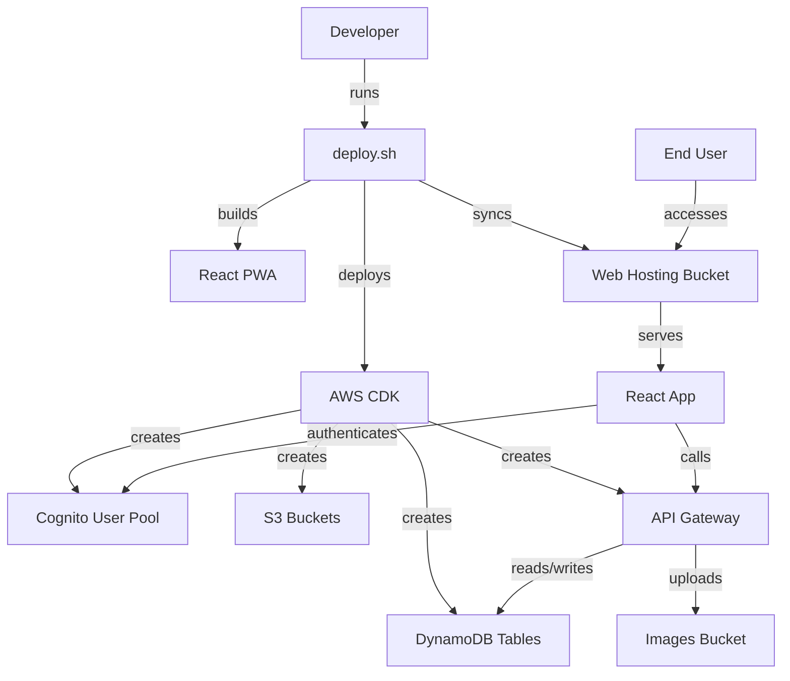
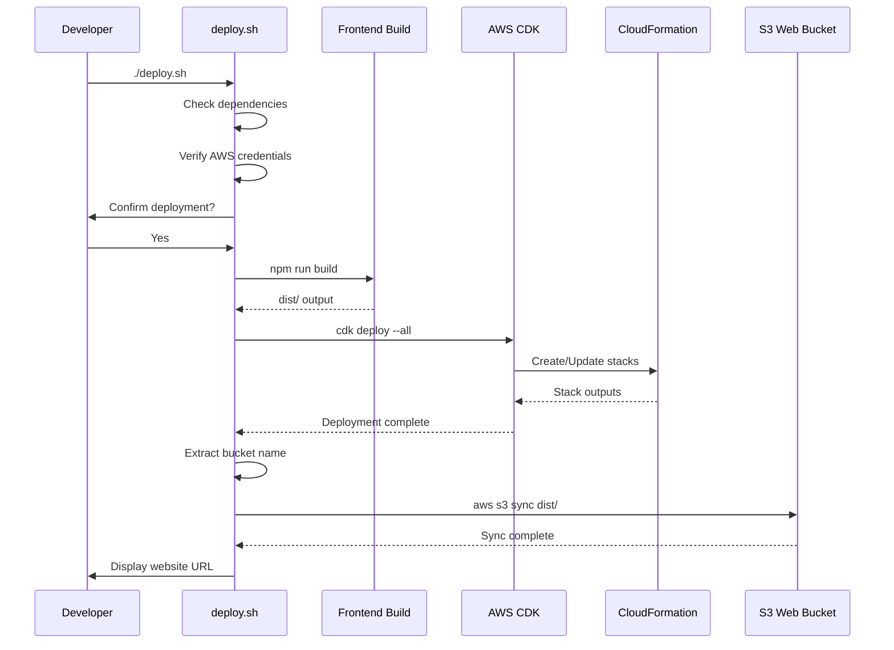

# Design Document: Initial Infrastructure Deployment

## Overview

This design implements a "Deployment First" strategy for the EcoBid platform, establishing a minimal but complete AWS infrastructure that can be deployed, verified, and iterated upon. The design focuses on three key areas:

1. **Infrastructure Review and Enhancement**: Validate existing CDK stacks and add web hosting capabilities
2. **Automated Deployment Pipeline**: Create a single-command deployment script that handles build and deploy
3. **Verification and Documentation**: Ensure deployment success and provide clear next steps

The design prioritizes Free Tier compliance, simplicity, and developer experience.

## Architecture

### High-Level Architecture



### Deployment Flow



## Components and Interfaces

### 1. CDK Stack Enhancements

#### StorageStack Modifications

The existing StorageStack creates an images bucket for user uploads. We need to add a separate web hosting bucket.

**New Component: Web Hosting Bucket**

```typescript
// Add to StorageStack
public readonly webBucket: s3.Bucket;

constructor(scope: Construct, id: string, props: StorageStackProps) {
  // ... existing code ...
  
  // Web hosting bucket (separate from images bucket)
  this.webBucket = new s3.Bucket(this, 'WebHostingBucket', {
    bucketName: `ecobid-web-${this.account}`,
    websiteIndexDocument: 'index.html',
    websiteErrorDocument: 'index.html', // SPA routing
    publicReadAccess: true,
    blockPublicAccess: new s3.BlockPublicAccess({
      blockPublicAcls: false,
      blockPublicPolicy: false,
      ignorePublicAcls: false,
      restrictPublicBuckets: false,
    }),
    removalPolicy: cdk.RemovalPolicy.DESTROY,
    autoDeleteObjects: true,
  });
  
  // Output website URL
  new cdk.CfnOutput(this, 'WebsiteUrl', {
    value: this.webBucket.bucketWebsiteUrl,
    description: 'Website URL',
    exportName: 'EcoBidWebsiteUrl',
  });
  
  new cdk.CfnOutput(this, 'WebBucketName', {
    value: this.webBucket.bucketName,
    description: 'Web hosting bucket name',
    exportName: 'EcoBidWebBucketName',
  });
}
```

**Rationale**: Separating web hosting from images bucket follows AWS best practices and simplifies permissions. Public read access on the web bucket is acceptable since it only contains static assets. The images bucket maintains stricter controls.

### 2. Deployment Script (deploy.sh)

The deployment script orchestrates the entire deployment process with proper error handling and user feedback.

**Script Structure**:

```bash
#!/bin/bash
set -e  # Exit on error

# Color codes for output
RED='\033[0;31m'
GREEN='\033[0;32m'
YELLOW='\033[1;33m'
NC='\033[0m' # No Color

# Logging
LOG_FILE="deployment.log"
exec > >(tee -a "$LOG_FILE")
exec 2>&1

# Functions:
# - check_dependencies(): Verify Node.js, AWS CLI, CDK CLI
# - verify_aws_credentials(): Check AWS credentials and display account info
# - build_frontend(): Build React app
# - deploy_infrastructure(): Run CDK deploy
# - sync_to_s3(): Upload frontend to S3
# - display_outputs(): Show CloudFormation outputs and next steps
```

**Key Features**:
- Dependency checking with helpful error messages
- AWS credential verification before deployment
- User confirmation prompt with account/region display
- Colored output for better readability
- Comprehensive logging to deployment.log
- Graceful error handling with cleanup instructions
- Final output showing website URL and all CloudFormation outputs

### 3. Frontend Minimal Implementation

The frontend needs a minimal "Hello World" implementation that can be deployed and verified.

**App.tsx**:

```typescript
function App() {
  return (
    <div className="min-h-screen bg-gray-50 flex items-center justify-center">
      <div className="text-center">
        <h1 className="text-4xl font-bold text-gray-900 mb-4">
          EcoBid
        </h1>
        <p className="text-xl text-gray-600 mb-8">
          Freecycling Made Simple
        </p>
        <div className="bg-green-100 border border-green-400 text-green-700 px-4 py-3 rounded">
          ✅ Infrastructure deployed successfully!
        </div>
        <p className="mt-4 text-sm text-gray-500">
          AWS Free Tier Optimized
        </p>
      </div>
    </div>
  );
}
```

**index.html** (ensure proper meta tags):

```html
<!DOCTYPE html>
<html lang="en">
  <head>
    <meta charset="UTF-8" />
    <meta name="viewport" content="width=device-width, initial-scale=1.0" />
    <meta name="theme-color" content="#10b981" />
    <meta name="description" content="EcoBid - Freecycling Made Simple" />
    <title>EcoBid</title>
  </head>
  <body>
    <div id="root"></div>
    <script type="module" src="/src/main.tsx"></script>
  </body>
</html>
```

### 4. Infrastructure Validation

Before deployment, the script validates existing infrastructure code against requirements.

**Validation Checks**:

1. **AuthStack**: Verify Cognito configuration (email sign-in, custom attributes)
2. **DatabaseStack**: Verify PAY_PER_REQUEST billing, streams enabled
3. **StorageStack**: Verify CORS, lifecycle policy, Rekognition permissions
4. **All Stacks**: Verify no VPC/NAT Gateway, RemovalPolicy.DESTROY set

These checks are informational (logged) rather than blocking, since the existing code already meets requirements.

## Data Models

### CloudFormation Outputs Structure

The deployment produces structured outputs that are consumed by the deployment script and used for frontend configuration.

```typescript
interface DeploymentOutputs {
  // Auth Stack
  UserPoolId: string;           // e.g., "us-east-1_abc123"
  UserPoolClientId: string;     // e.g., "abc123def456"
  
  // Database Stack
  ItemsTableName: string;       // "ecobid-items"
  
  // Storage Stack
  BucketName: string;           // "ecobid-images-123456789"
  WebBucketName: string;        // "ecobid-web-123456789"
  WebsiteUrl: string;           // "http://ecobid-web-123456789.s3-website-us-east-1.amazonaws.com"
  
  // API Stack
  ApiUrl: string;               // "https://abc123.execute-api.us-east-1.amazonaws.com/prod/"
}
```

### Deployment Log Format

```
[TIMESTAMP] [LEVEL] Message
```

Example:
```
[2024-01-15 10:30:00] [INFO] Starting deployment...
[2024-01-15 10:30:05] [INFO] AWS Account: 123456789012, Region: us-east-1
[2024-01-15 10:30:10] [INFO] Building frontend...
[2024-01-15 10:32:00] [SUCCESS] Frontend build complete
[2024-01-15 10:32:05] [INFO] Deploying infrastructure...
[2024-01-15 10:35:00] [SUCCESS] Infrastructure deployed
[2024-01-15 10:35:05] [INFO] Syncing to S3...
[2024-01-15 10:35:30] [SUCCESS] Deployment complete!
```

## Correctness Properties

*A property is a characteristic or behavior that should hold true across all valid executions of a system—essentially, a formal statement about what the system should do. Properties serve as the bridge between human-readable specifications and machine-verifiable correctness guarantees.*


### Property Reflection

After analyzing all acceptance criteria, I identified several areas of redundancy:

1. **Error Handling Properties**: Criteria 4.5, 4.7, 4.10, and 9.1 all relate to script error handling. These can be consolidated into a single comprehensive property about error propagation.

2. **Free Tier Compliance**: Criteria 1.7 and 8.4 are duplicates (no VPC/NAT Gateway). Criteria 8.1, 8.2, 8.3 can be combined into a single property about resource configuration compliance.

3. **CloudFormation Outputs**: Criteria 3.1-3.7 are all specific examples that should be tested as individual examples, not properties. Criterion 3.8 is the property that covers displaying all outputs.

4. **Script Dependency Checks**: Criterion 4.3 is a property about error messages for missing dependencies, which is more specific than needed.

5. **Documentation Content**: Criteria 10.2-10.7 are all specific examples of documentation content, not properties.

The consolidated properties focus on:
- Infrastructure configuration compliance (Free Tier, no prohibited resources)
- Script error handling and propagation
- Build output size constraints
- Output display completeness

### Correctness Properties

Property 1: No Prohibited AWS Resources
*For any* CDK stack file in the infrastructure directory, the code SHALL NOT contain VPC or NAT Gateway construct instantiations
**Validates: Requirements 1.7, 8.4**

Property 2: Free Tier Resource Configuration
*For all* Lambda functions, the runtime SHALL be Node.js 20.x, and *for all* DynamoDB tables, the billing mode SHALL be PAY_PER_REQUEST, and *for all* S3 buckets, the storage class SHALL be Standard
**Validates: Requirements 8.1, 8.2, 8.3**

Property 3: Deployment Script Error Propagation
*For any* command execution in the deployment script (frontend build, CDK deploy, S3 sync), if the command fails, the script SHALL exit with a non-zero status code
**Validates: Requirements 4.5, 4.7, 4.10, 9.1**

Property 4: CloudFormation Output Display
*For all* CloudFormation outputs produced by the CDK deployment, the deployment script SHALL display the output name and value in the terminal
**Validates: Requirements 3.8**

Property 5: Frontend Build Size Constraint
*For any* successful frontend build, the total size of the frontend/dist directory SHALL be less than 5MB
**Validates: Requirements 5.6**

Property 6: Missing Dependency Error Messages
*For any* required dependency (Node.js, AWS CLI, CDK CLI) that is not installed, the deployment script SHALL display an error message that includes the dependency name and installation instructions
**Validates: Requirements 4.3**

Property 7: Error Log Display
*For any* error that occurs during deployment, the deployment script SHALL display the relevant section of the deployment.log file
**Validates: Requirements 9.5**

Property 8: RemovalPolicy Configuration
*For all* stateful resources (S3 buckets, DynamoDB tables, Cognito User Pools) in development stacks, the RemovalPolicy SHALL be set to DESTROY
**Validates: Requirements 1.8**

## Error Handling

### Deployment Script Error Handling

The deployment script uses bash's `set -e` to exit immediately on any command failure. Each major step is wrapped with error checking:

```bash
#!/bin/bash
set -e  # Exit on error
set -o pipefail  # Catch errors in pipes

# Trap errors and display helpful messages
trap 'handle_error $? $LINENO' ERR

handle_error() {
  local exit_code=$1
  local line_number=$2
  echo -e "${RED}Error occurred in deployment script at line $line_number (exit code: $exit_code)${NC}"
  echo "Check deployment.log for details"
  tail -n 20 deployment.log
  echo ""
  echo "To clean up failed deployment:"
  echo "  cd infrastructure && cdk destroy --all"
  exit $exit_code
}
```

### CDK Deployment Error Handling

CDK automatically handles rollback on deployment failure through CloudFormation. If any resource fails to create or update, CloudFormation rolls back the entire stack to the previous stable state.

### S3 Sync Error Handling

S3 sync failures are treated differently from infrastructure failures:

```bash
# S3 sync with error handling
if ! aws s3 sync frontend/dist/ s3://$WEB_BUCKET_NAME --delete; then
  echo -e "${RED}Failed to sync frontend to S3${NC}"
  echo "Infrastructure is deployed, but frontend upload failed"
  echo "You can manually sync with:"
  echo "  aws s3 sync frontend/dist/ s3://$WEB_BUCKET_NAME --delete"
  exit 1
fi
```

This approach ensures infrastructure remains deployed even if frontend upload fails, allowing manual retry without redeploying infrastructure.

### Frontend Build Error Handling

Frontend build errors are caught and displayed with context:

```bash
echo "Building frontend..."
cd frontend
if ! npm run build; then
  echo -e "${RED}Frontend build failed${NC}"
  echo "Check the error messages above"
  echo "Common issues:"
  echo "  - Missing dependencies: run 'npm install'"
  echo "  - TypeScript errors: check src/ files"
  exit 1
fi
cd ..
```

## Testing Strategy

This feature requires a dual testing approach combining unit tests for specific examples and property-based tests for universal properties.

### Unit Testing Approach

Unit tests focus on specific examples and edge cases:

1. **Infrastructure Code Validation**:
   - Test that AuthStack creates Cognito User Pool with correct attributes (example)
   - Test that DatabaseStack creates tables with PAY_PER_REQUEST billing (example)
   - Test that StorageStack creates web hosting bucket with correct configuration (example)
   - Test that all stacks produce required CloudFormation outputs (examples)

2. **Deployment Script Validation**:
   - Test that deploy.sh exists and is executable (example)
   - Test that script contains required commands (npm run build, cdk deploy, aws s3 sync) (examples)
   - Test that script includes dependency checks (example)
   - Test that script includes AWS credential verification (example)

3. **Frontend Validation**:
   - Test that App.tsx contains Hello World component (example)
   - Test that index.html contains required meta tags (example)
   - Test that vite.config.ts includes PWA plugin (example)

4. **Documentation Validation**:
   - Test that DEPLOYMENT.md exists and contains required sections (examples)

### Property-Based Testing Approach

Property-based tests verify universal properties across all inputs:

1. **Property 1: No Prohibited AWS Resources**
   - Generate: Parse all TypeScript files in infrastructure/lib/
   - Test: For each file, verify no VPC or NAT Gateway constructs
   - Library: Use TypeScript AST parser or regex matching
   - Iterations: 1 (deterministic check across all files)

2. **Property 2: Free Tier Resource Configuration**
   - Generate: Synthesize CDK app to CloudFormation template
   - Test: For all Lambda::Function resources, verify Runtime is nodejs20.x
   - Test: For all DynamoDB::Table resources, verify BillingMode is PAY_PER_REQUEST
   - Test: For all S3::Bucket resources, verify StorageClass is STANDARD (or default)
   - Library: JSON parsing of CloudFormation template
   - Iterations: 1 (deterministic check of synthesized template)

3. **Property 3: Deployment Script Error Propagation**
   - Generate: Mock different command failures (build, deploy, sync)
   - Test: For each failure scenario, verify script exits with non-zero status
   - Library: Bash testing framework (bats or similar)
   - Iterations: 100 (test various failure scenarios)

4. **Property 4: CloudFormation Output Display**
   - Generate: Mock CloudFormation outputs with varying numbers of outputs
   - Test: For each output, verify it appears in script output
   - Library: Bash testing with mocked AWS CLI
   - Iterations: 100 (test with different output sets)

5. **Property 5: Frontend Build Size Constraint**
   - Generate: Build frontend multiple times with different configurations
   - Test: For each build, verify dist/ directory size < 5MB
   - Library: Shell script with du command
   - Iterations: 10 (build is deterministic, but test with different Node versions)

6. **Property 6: Missing Dependency Error Messages**
   - Generate: Mock scenarios where each dependency is missing
   - Test: For each missing dependency, verify error message contains name and instructions
   - Library: Bash testing framework
   - Iterations: 100 (test various combinations of missing dependencies)

7. **Property 7: Error Log Display**
   - Generate: Inject errors at different points in deployment
   - Test: For each error, verify relevant log section is displayed
   - Library: Bash testing framework
   - Iterations: 100 (test errors at different stages)

8. **Property 8: RemovalPolicy Configuration**
   - Generate: Synthesize CDK app to CloudFormation template
   - Test: For all stateful resources, verify DeletionPolicy is Delete
   - Library: JSON parsing of CloudFormation template
   - Iterations: 1 (deterministic check)

### Testing Configuration

**Property-Based Testing Library**: For bash script testing, use `bats-core` (Bash Automated Testing System). For CDK/CloudFormation validation, use Node.js with `fast-check` library.

**Test Execution**:
- Unit tests: Run with `npm test` in infrastructure directory
- Property tests: Run with `npm run test:properties` (minimum 100 iterations per property)
- Integration test: Run actual deployment to test AWS account

**Test Tagging**:
Each property test must include a comment tag:
```typescript
// Feature: initial-infrastructure-deployment, Property 2: Free Tier Resource Configuration
test('all Lambda functions use Node.js 20.x runtime', async () => {
  // property test implementation
});
```

### Integration Testing

The ultimate integration test is running the actual deployment:

1. Run `./deploy.sh` in a clean AWS account
2. Verify all CloudFormation stacks are created
3. Verify website URL is accessible and displays Hello World
4. Verify all outputs are displayed correctly
5. Run `cd infrastructure && cdk destroy --all` to clean up

This integration test validates the entire deployment pipeline end-to-end.

## Implementation Notes

### CDK Synthesis for Testing

To test infrastructure code without deploying, use CDK synthesis:

```bash
cd infrastructure
npm run cdk synth > template.json
```

This generates CloudFormation templates that can be validated programmatically.

### Bash Script Testing Best Practices

1. **Use bats-core**: Industry-standard bash testing framework
2. **Mock AWS CLI**: Use `aws-cli-mock` or similar to avoid actual AWS calls during testing
3. **Test in isolation**: Each test should set up its own environment and clean up after
4. **Use temporary directories**: Create temp dirs for testing file operations

### Frontend Build Optimization

To keep build size under 5MB:

1. **Code splitting**: Vite automatically splits code
2. **Tree shaking**: Remove unused code
3. **Minification**: Enabled by default in production build
4. **Asset optimization**: Compress images and fonts
5. **Lazy loading**: Load components on demand

Current minimal implementation should be well under 1MB.

### AWS Free Tier Monitoring

While not part of this deployment, recommend setting up AWS Budgets:

```bash
aws budgets create-budget \
  --account-id $ACCOUNT_ID \
  --budget file://budget.json \
  --notifications-with-subscribers file://notifications.json
```

This provides alerts before exceeding Free Tier limits.

## Deployment Workflow

### Prerequisites

1. AWS Account with credentials configured
2. Node.js 18+ installed
3. AWS CLI v2 installed
4. AWS CDK CLI installed (`npm install -g aws-cdk`)

### Deployment Steps

1. **Clone repository and install dependencies**:
   ```bash
   git clone <repo-url>
   cd ecobid
   npm install
   cd frontend && npm install && cd ..
   cd infrastructure && npm install && cd ..
   ```

2. **Bootstrap CDK (first time only)**:
   ```bash
   cd infrastructure
   cdk bootstrap
   cd ..
   ```

3. **Run deployment script**:
   ```bash
   chmod +x deploy.sh
   ./deploy.sh
   ```

4. **Verify deployment**:
   - Open the website URL displayed in output
   - Check AWS Console for created resources
   - Verify CloudFormation stacks are in CREATE_COMPLETE state

5. **Save outputs for frontend configuration**:
   - Copy User Pool ID and Client ID
   - These will be needed when implementing authentication

### Cleanup

To destroy all infrastructure:

```bash
cd infrastructure
cdk destroy --all
```

This removes all AWS resources and stops any charges.

## Security Considerations

### S3 Bucket Security

**Web Hosting Bucket**: Public read access is required for static website hosting. This is acceptable because:
- Bucket only contains public static assets (HTML, CSS, JS)
- No sensitive data is stored in this bucket
- Bucket policy restricts to read-only access

**Images Bucket**: Maintains stricter access controls:
- No public access
- Access only via signed URLs from Lambda
- CORS configured for specific origins only

### Cognito Security

- Password policy enforces strong passwords (8+ chars, upper, lower, digits)
- Email verification required for sign-up
- Account recovery via email only
- MFA can be added later for enhanced security

### API Gateway Security

- Cognito authorizer required for all protected endpoints
- CORS configured to allow frontend origin
- Rate limiting can be added via usage plans

### IAM Permissions

All Lambda functions follow principle of least privilege:
- Only granted permissions needed for their specific function
- No wildcard permissions except where required (Rekognition)
- Scoped to specific resources where possible

## Future Enhancements

This initial deployment establishes the foundation. Future enhancements include:

1. **CloudFront Distribution**: Add CDN for better performance and HTTPS
2. **Custom Domain**: Configure Route 53 and ACM certificate
3. **CI/CD Pipeline**: Automate deployment with GitHub Actions or CodePipeline
4. **Monitoring**: Add CloudWatch dashboards and alarms
5. **Cost Monitoring**: Implement AWS Budgets and Cost Explorer alerts
6. **Environment Separation**: Create dev/staging/prod environments
7. **Infrastructure Tests**: Add automated CDK testing with Jest
8. **Blue/Green Deployment**: Implement zero-downtime deployments

These enhancements can be added incrementally without disrupting the current deployment.
